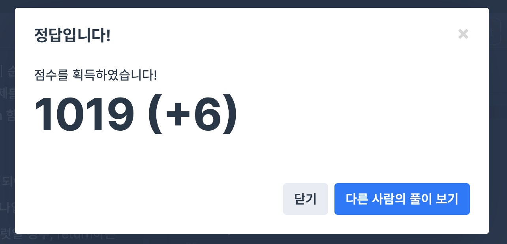

## 문제
- 프로그래머스 : 모의고사
- https://programmers.co.kr/learn/courses/30/lessons/42840


## 풀이
- 각 수포자에게 배열값을 할당하는 것이 아니라, 반복되는 값만 부여했다.
- 나머지를 이용해 배열을 탐색해 수포자의 답변과 정답을 비교한다.


## 코드
```c++
#include <string>
#include <vector>

using namespace std;

int test1[5] = {1,2,3,4,5};
int test2[8] = {2,1,2,3,2,4,2,5};
int test3[10] = {3,3,1,1,2,2,4,4,5,5};

int max(int a, int b){
    return a<b ? b : a;
}

vector<int> solution(vector<int> answers) {
    vector<int> answer;
    
    vector<int> cnt(3);
    int maxScore = 0;
    
    for(int i=0; i<answers.size(); i++){
        if(test1[i%5] == answers[i]) cnt[0]++;
        if(test2[i%8] == answers[i]) cnt[1]++;
        if(test3[i%10] == answers[i]) cnt[2]++;
    }
    
    maxScore = max(max(cnt[0], cnt[1]), cnt[2]);
    
    for(int i=0; i<3; i++){
        if(cnt[i]==maxScore) answer.push_back(i+1);
    }
    
    return answer;
}
```


## screenshot



## 반성
- 나머지를 활용하자!
